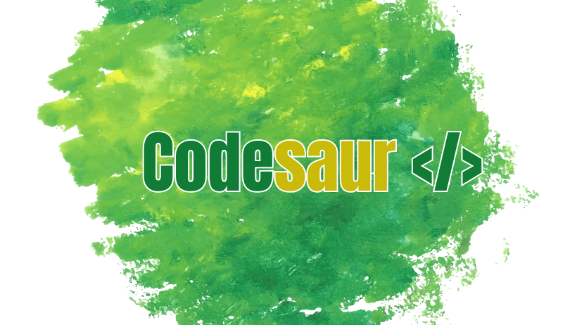

 

## Olá e bem vindo(a) ao Codesaur. 🙋🏻‍♂️🦖💻🫶

### Canais e Redes Sociais

---

### Status Gerais

---

### Tecnologias

 
  
  
  
  
  
  
  
  
  

---

### Sobre

Olá e muito prazer.

Antes de seguir adiante saiba que este é um canal que visa de maneira despretensiosa ensinar os princípios básicos de design (UI/UX) até programação (frontend e backend).

A ideia é falar e trazer questões da área de tecnologia, apresentar o básico para quem está ou quer começar na área de programação, ensinar como produzir um layout em Figma, entender o que é uma IDE, aprender sobre HTML e CSS para composição básica do frontend de um site, aprender básico de lógica e como produzir algoritmos e por fim, produzirmos juntos um sistema de ponta a ponta.

Se você está disposto(a) a conhecer e me acompanhar nesse processo onde, ambos aprenderemos juntos, seja muito bem vindo ou muito bem vinda!

